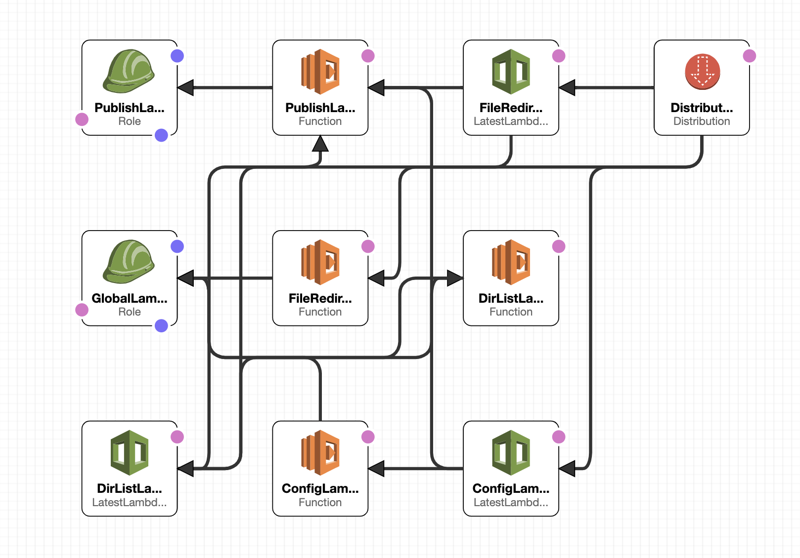

#Open NEXRAD Data Access - AWS S3 Buckets

The AWS Public Dataset Program hosts real time feeds of [level 2 & 3 NEXRAD data](https://registry.opendata.aws/noaa-nexrad/) in open S3 buckets available for anyone to use. However these buckets aren't formatted properly for programs that ingest data via the [Open NEXRAD Data Access Specification](https://allisonhouse.com/Documents/ondas.txt) to be able to work with them.

This provides a minimal CloudFormation template to set up 3 lambdas necessary for serving the data. The lambdas provide a static config.cfg file, a dynamic dir.list, and a redirect to the actual product file.



## config.cfg

The CloudFormation template inline lambdas are limited to 4096 bytes. To provide the static config.cfg file which is somewhere around 9000 bytes, it is necessary to pre-upload it to S3.

```
zip config.zip index
aws s3 cp config.zip s3://ondas-zac/config.zip --acl public-read
```


